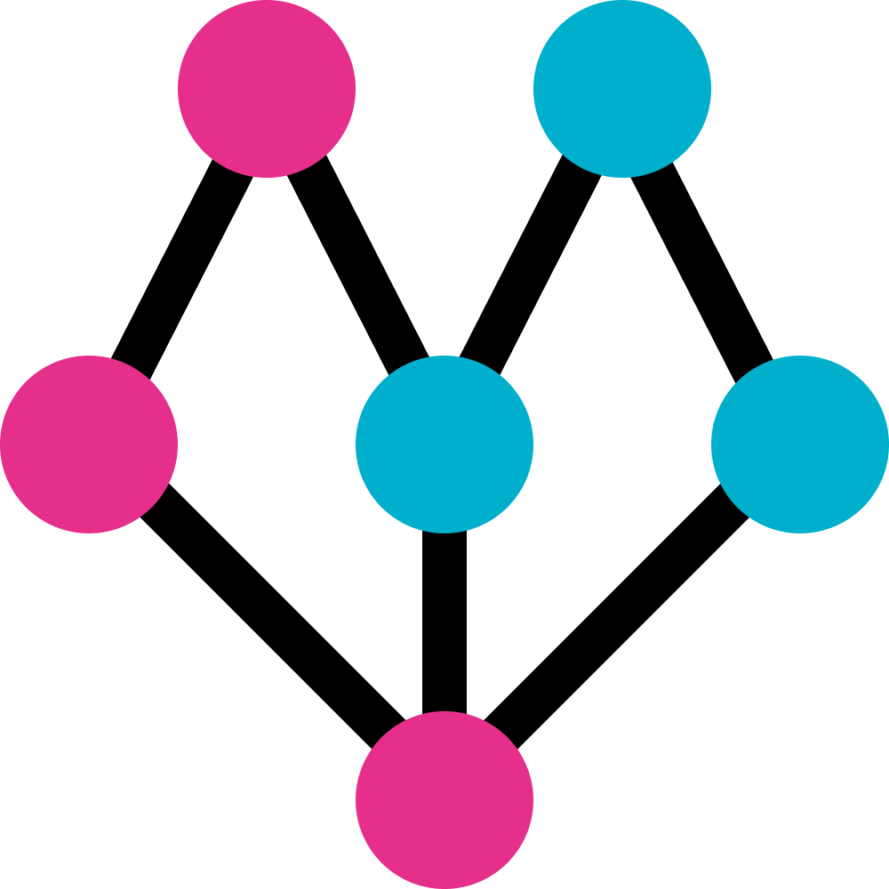
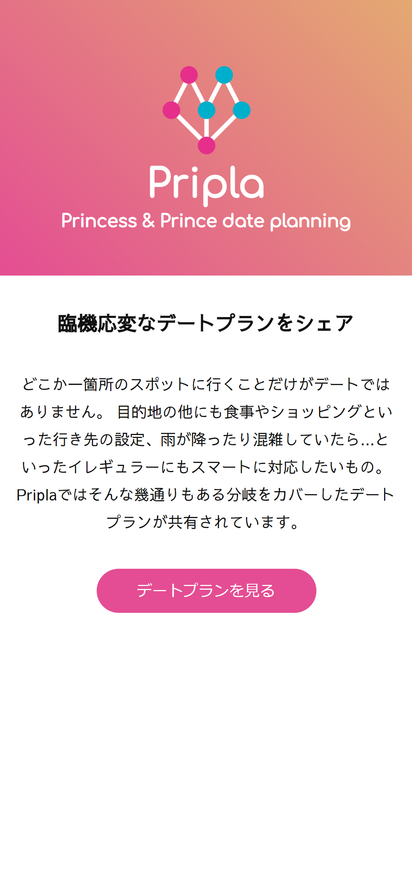
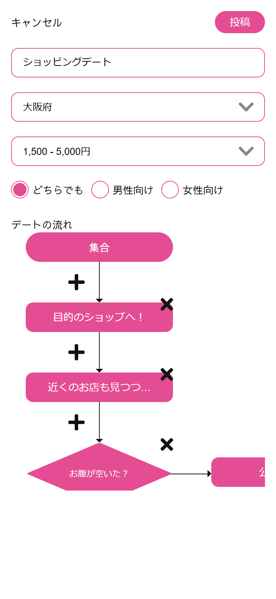

# Pripla
**Princess & Prince date planning service.**

## 製品概要

[プレゼン資料](./documents/presentation.pdf)  
[デモ動画(youtube)](https://www.youtube.com/watch?v=UvOajAmvPSw)

### 背景(製品開発のきっかけ、課題等）

- 一日のデートを考える際、メインの目的地以外をどうするかを考えるのが大変。
- 天気や疲れ具合などその日の状況によって色々なパターンを考えておかないといけない。
-これまでのサービスは目的地単位でしか情報を得られなかったが、デートは一日単位なので距離などを考えて予定しないといけない。

こういった自分たちの実体験から課題を感じ、開発に着手した。

### 製品説明（具体的な製品の説明）

あなたはどうやってデートプランを計画するだろうか。雑誌を読む？インターネットで検索する？それらはお店の場所やメニューなど『点』の情報ではないだろうか？  
しかし実際のデートは『点』ではない、『線』なのである。  
A店に行ったあとB店に行き、Cを見ながら少し歩いてD店に行く。雨が降ったらCを辞めてEを――。  
といった具合にその時々によって分岐していくデートプランを、本サービスは高い対応力でサポートします。

### 特長
1. `目的地` ではなく `1日のプラン` にフォーカス
2. フローチャート形式で直感的に行程や分岐を表現
3.  共有されたプランをエリア, 予算などから絞り込み他の人が参考にできるように

### 解決出来ること

- デート中のアクシデントへの対応
- 恋愛上級者たちがどのようなプランニングをしているのかの参考にできる
- 行き先は決まっているがそれ以外の予定に困っているとき、周辺スポットを知ることができる

### 今後の展望

- 検索軸やタグ付けなどを強化し、より直感的にプランを探しやすくする
- いいね, 参考になった等の投稿者へのフィードバック機能を追加

### 注力したこと（こだわり等）
- 操作感と見た目のわかりやすさを重視
  - 「フローチャート」という言葉は我々エンジニアは理解できるがターゲット層が必ずしも理解できるとは限らないと考え、これらの単語を排除
- 単純でわかりやすい画面設計
- デプロイの自動化
  - GitHub Actionsを用い、masterブランチへマージされた際に自動で公開されるよう設定([organization側リポジトリ](https://github.com/uyupun/pripla)に設定)

## 開発技術
### 活用した技術
#### フレームワーク・ライブラリ・モジュール
* フロント
  * Nuxt.js
* バックエンド
  * Laravel, MySQL
* インフラなど
  * docker-compose, nginx, さくらのVPS

## ドキュメント類

- [APIドキュメント](./documents/api_document.md)
- [カンプ](https://www.figma.com/file/4yro9aYdo3e74E17vFvDOI/Pripla?node-id=0%3A1)

### 本番環境

- [Pripla(フロントエンド)](https://pripla.uyupun.tech/)
- [Pripla API(バックエンド)](https://api.pripla.uyupun.tech/)
